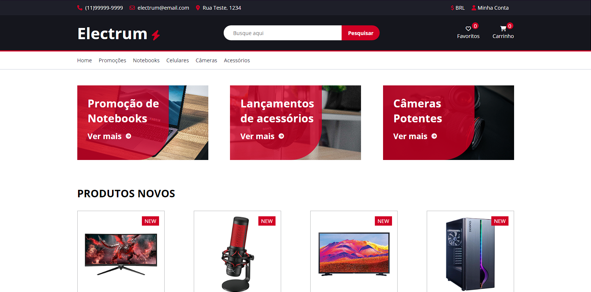
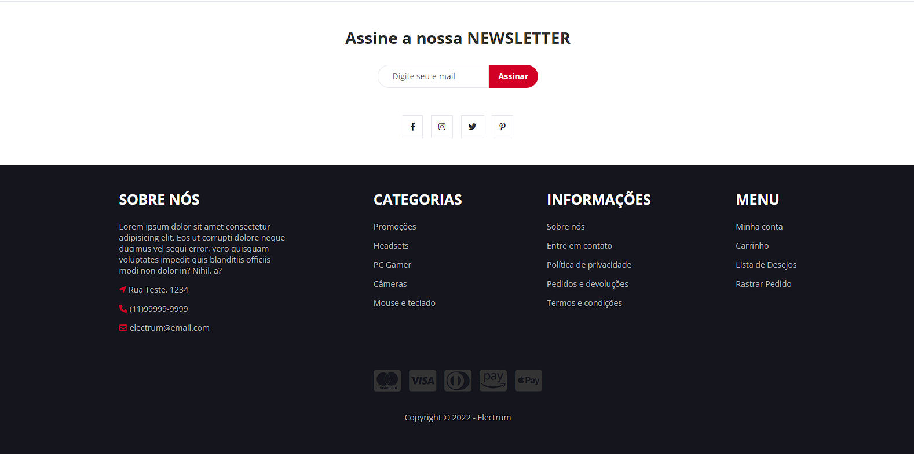
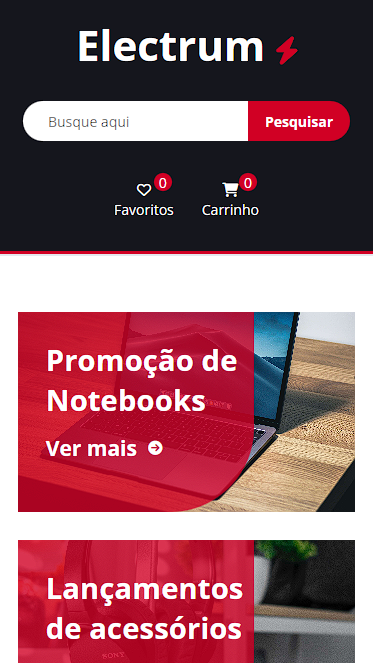
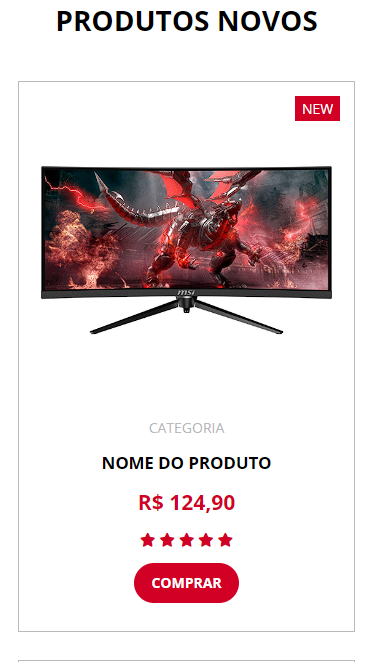
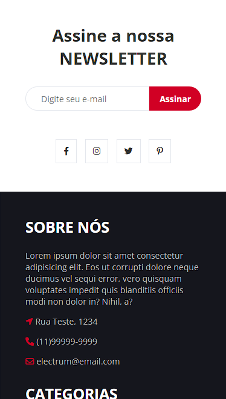

# Projeto Electrum

## Sobre o Electrum

| :placard: Vitrine.Dev | Othon Santos da Silva |
| -------------  | --- |
| :sparkles: Name        | **Projeto Electrum**
| :label: Technologies | HTML e SASS
| :camera: Img         | 


<p>
  É um site desenvolvido, durante o curso de SASS da Udemy, por Matheus Battisti do canal <strong>Hora de Codar</strong>. Envolvendo conceitos importantes sobre o pré-processador e também como estruturar bem um projeto desenvolvido com SASS. 
</p>
<p>
  O site tem por finalidade demonstrar a homepage de um site que simula uma empresa que vende eletrônicos.
</p>

## Layout web





## Layou mobile

<div>
  
  
  
  
</div>

## Tecnologias utilizadas
<p>Linguagens e padrões que foram utilizados para desenvolver o app</p>

## Front-end
- HTML
- SASS

### Competências 
- Layout responsivo 
- Arquitetura SMACSS

## Como executar o projeto

Instruções para executar o app

## Front-end
Pré-requisitos: Navegador

Clonar repositório

```bash
  https://github.com/othonss/Projeto-Electrum-sass.git
```
Editar com IDE ou Editor de preferência

Acessar utilizando navegador de preferência

## Autor 

Othon Santos da Silva

<a href="https://www.linkedin.com/in/othon-santos-35531b129/" target="_blank">
    
 </a>
